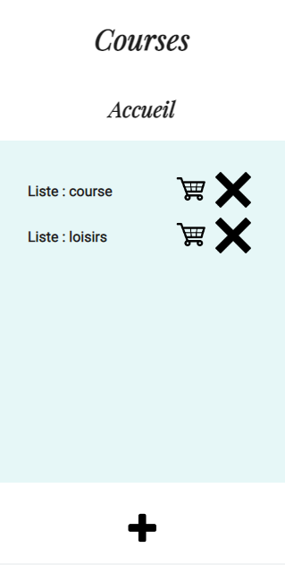
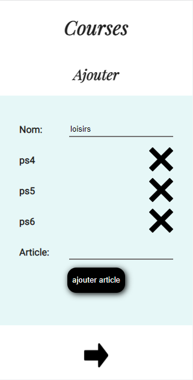
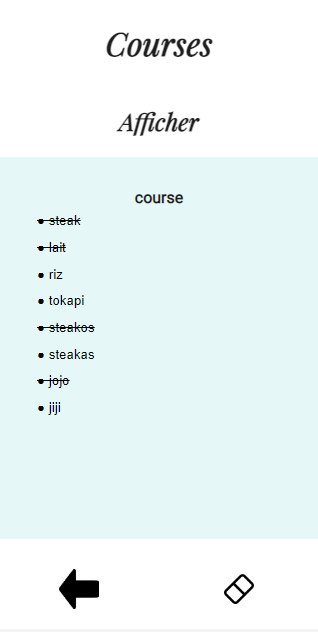

# Gestion de listes de courses

Serveur : Tomcat 9

lancer le script.txt dans une console mySQL pour creer la DB

## Accueil

Page d'accueil du site, il affiche les differentes liste déjà 
créées en DB et permet soit d'en créée une nouvelle, ajouter ou retirer des éléments à
une existente ou de commencer les courses avec l'une d'elle, on peut également supprimer une liste.

## Ajouter

Page qui permet d'ajouter ou retirer un élement a la liste, il suffit d'entrer 
le nom de la liste dans le champ prévu puis notre article et de cliquer sur "ajouter un article".

## Afficher

Page qui permet de cocher ou décocher les éléments de la liste au fur et à mesure que l'on met les articles 
physiquement dans son panier ou de reinitialiser la liste (tout les articles décochés).
